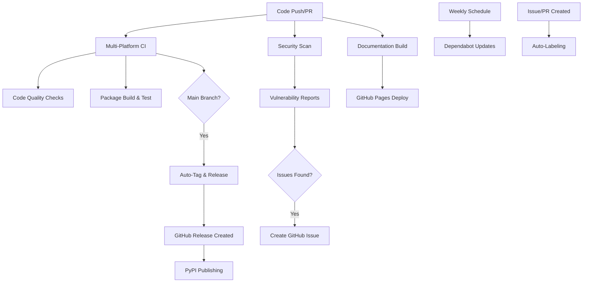

# GitHub Actions Workflows

This directory contains comprehensive GitHub Actions workflows for automated testing, security, publishing, and documentation for the generatecv library.

## 🔄 Current Workflows

### 🧪 `python-ci.yml` - Continuous Integration

**Triggers:**
- Push to `main` branch
- Pull requests to `main` branch  
- Manual dispatch

**What it does:**

1. **Multi-Platform Testing:**
   - Tests on Ubuntu, Windows, and macOS
   - Python 3.13 support
   - Full dependency installation with UV

2. **Code Quality Checks:**
   - **Linting**: Runs Ruff to check code style and common issues
   - **Formatting**: Validates code formatting with Black
   - **Type Checking**: Performs static type analysis with pyrefly
   - **Testing**: Executes test suite with pytest and generates coverage reports

3. **Package Verification:**
   - Builds the package and verifies metadata
   - Tests package installation
   - Uploads build artifacts for inspection

4. **Coverage Reporting:**
   - Uploads coverage data to Codecov for tracking test coverage over time

5. **Auto-Tagging & Releases:**
   - Extracts version from `pyproject.toml`
   - Compares with latest Git tag
   - Creates new tag and GitHub Release if version is newer
   - **Note**: This only runs on push to `main` branch, NOT on pull requests

### 🔒 `security.yml` - Security Scanning

**Triggers:**
- Push to `main` branch
- Pull requests to `main` branch
- Scheduled: Every 3 days at 12:00 UTC
- Manual dispatch

**What it does:**

1. **Vulnerability Scanning:**
   - Uses Safety to check for known CVEs in dependencies
   - Scans all installed packages for security issues
   - Reports vulnerable packages with fix recommendations

2. **Code Security Analysis:**
   - Uses Bandit to analyze source code for security issues
   - Detects common security anti-patterns and vulnerabilities
   - Checks for hardcoded secrets, SQL injection risks, etc.

3. **Automated Reporting:**
   - Creates detailed security reports in Markdown format
   - Uploads reports as GitHub Actions artifacts
   - Automatically creates GitHub Issues when vulnerabilities found
   - Saves historical reports to repository (main branch only)

4. **Issue Management:**
   - Closes previous security issues when creating new ones
   - Labels issues appropriately (security-scan, high-priority, etc.)
   - Provides detailed remediation guidance

### 🚀 `publish.yml` - PyPI Publishing

**Triggers:**
- GitHub Releases (published)
- Manual dispatch (with TestPyPI option)

**What it does:**

1. **Package Building:**
   - Builds wheel and source distributions
   - Validates package metadata with twine
   - Runs tests before publishing to ensure quality

2. **PyPI Publishing (OIDC):**
   - Uses OpenID Connect trusted publishing (no tokens required!)
   - Publishes to PyPI automatically on GitHub Release
   - Environment protection with required reviewers

3. **TestPyPI Support:**
   - Manual workflow dispatch option for testing
   - Separate environment configuration for test publishing
   - Safe testing before production releases

4. **Artifact Management:**
   - Uploads build artifacts for inspection
   - Maintains build history and audit trail

### 📚 `docs.yml` - Documentation

**Triggers:**
- Push to `main` branch
- Pull requests to `main` branch
- Manual dispatch

**What it does:**

1. **Documentation Generation:**
   - Uses MkDocs with Material theme for modern documentation
   - Auto-generates API documentation from docstrings
   - Creates comprehensive documentation structure

2. **Content Creation:**
   - Auto-generates documentation files if missing
   - Includes getting started guides, examples, and API reference
   - Maintains consistent documentation structure

3. **GitHub Pages Deployment:**
   - Automatically deploys to GitHub Pages on main branch
   - Available at: `https://yantology.github.io/generatecv`
   - Uploads documentation artifacts for review

### 🏷️ `auto-label.yml` - Issue & PR Labeling

**Triggers:**
- New issues opened
- New pull requests opened

**What it does:**

1. **Smart Issue Labeling:**
   - Analyzes issue titles and content
   - Auto-applies relevant labels (bug, enhancement, security, etc.)
   - Adds triage label for manual review

2. **PR Size Detection:**
   - Calculates PR size based on line changes
   - Applies size labels (XS, S, M, L, XL)
   - Helps with review prioritization

3. **Type Classification:**
   - Detects PR types (feature, bugfix, docs, etc.)
   - Identifies breaking changes
   - Labels dependency updates and CI changes

## 📋 Dependency Management

### `dependabot.yml` - Automated Updates

**Schedule:** Weekly on Mondays

**What it manages:**

1. **Python Dependencies:**
   - Monitors `pyproject.toml` for outdated packages
   - Creates PRs for security updates and version bumps
   - Includes both production and development dependencies

2. **GitHub Actions:**
   - Keeps workflow actions up to date
   - Ensures security patches for CI/CD tools
   - Maintains compatibility with latest features

## 🔧 Setup Instructions

### 1. PyPI Publishing Setup (OIDC)

**No tokens required!** Modern trusted publishing with OpenID Connect.

1. **PyPI Configuration:**
   - Go to [PyPI Publishing Settings](https://pypi.org/manage/account/publishing/)
   - Add new trusted publisher:
     - Project: `generatecv`
     - Owner: `yantology`
     - Repository: `generatecv`
     - Workflow: `publish.yml`
     - Environment: `pypi`

2. **GitHub Environments:**
   - Create `pypi` environment in repository settings
   - Add protection rules (require reviewers, restrict to main branch)
   - Optional: Create `testpypi` environment for testing

### 2. Documentation Setup

1. **Enable GitHub Pages:**
   - Repository Settings → Pages
   - Source: Deploy from branch
   - Branch: `gh-pages` (auto-created)

2. **Documentation will be available at:**
   - `https://yantology.github.io/generatecv`

### 3. Security Integration

1. **Codecov (Optional):**
   - Sign up at [codecov.io](https://codecov.io/)
   - Connect repository
   - Add `CODECOV_TOKEN` to repository secrets

### 4. Labels Setup

The auto-labeling workflow expects these labels to exist:

**Priority:** `high-priority`, `medium-priority`, `low-priority`
**Security:** `security-scan`, `security-alert`, `needs-triage`
**Size:** `size/XS`, `size/S`, `size/M`, `size/L`, `size/XL`
**Type:** `bug`, `enhancement`, `documentation`, `tests`, `dependencies`
**Special:** `automated`, `breaking-change`, `github-actions`

## 🎯 Development Workflow

### Local Development

```bash
# Install dependencies
uv sync --dev --group docs --group security

# Run quality checks locally
uv run ruff check .
uv run black --check .
uv run pyrefly check
uv run pytest --cov=generatecv

# Run security scans
uv run bandit -r src/
uv run safety check

# Build documentation
uv run mkdocs serve  # Local preview
uv run mkdocs build  # Build static site

# Build package
uv build
uv run twine check dist/*
```

### Release Process

1. **Update version** in `pyproject.toml`
2. **Commit and push** to main branch
3. **Create GitHub Release:**
   - Tag: `v{version}` (matching pyproject.toml)
   - Auto-generate release notes
   - Publish release
4. **Automated publishing** to PyPI follows

## 📊 Workflow Architecture



## 🔍 Monitoring & Maintenance

### Workflow Health

- **CI Success Rate**: Monitor Actions tab for failed runs
- **Security Alerts**: Check Issues tab for security-scan labels
- **Dependency Updates**: Review Dependabot PRs weekly
- **Documentation**: Verify GitHub Pages deployment

### Performance Metrics

- **Build Times**: Track CI duration for performance regressions
- **Test Coverage**: Monitor coverage trends in Codecov
- **Security Posture**: Review security scan frequency and findings
- **Release Cadence**: Track release frequency and automation success

## 🚨 Troubleshooting

### Common Issues

1. **PyPI Publishing Fails:**
   - Verify environment configuration matches PyPI trusted publisher
   - Check version in pyproject.toml is newer than last published
   - Ensure GitHub Release triggers the workflow

2. **Security Scans Create False Positives:**
   - Review Bandit configuration in pyproject.toml
   - Update Security dependencies if needed
   - Adjust scan sensitivity if required

3. **Documentation Build Fails:**
   - Check MkDocs configuration syntax
   - Verify all referenced files exist
   - Review Python import errors in documentation

4. **Multi-Platform Tests Fail:**
   - Check platform-specific code behavior
   - Review file path handling differences
   - Verify dependency compatibility across platforms

### Getting Help

- Create an issue with the `question` label for workflow-related questions
- Check the Actions tab for detailed failure logs
- Review individual workflow run outputs for specific error messages

---

The workflow system provides comprehensive automation for development, security, and publishing processes while maintaining high code quality and security standards. All workflows are designed to be maintainable, transparent, and follow GitHub Actions best practices.